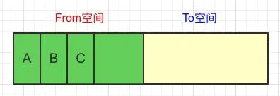
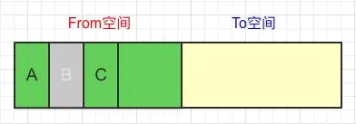
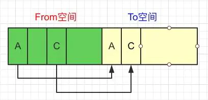
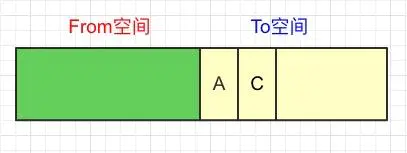
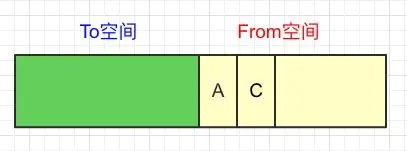
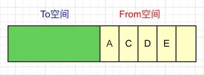
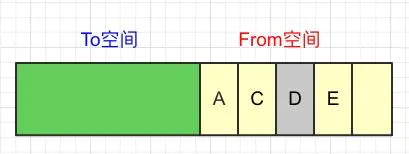
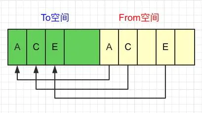
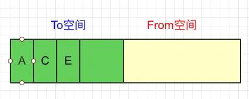
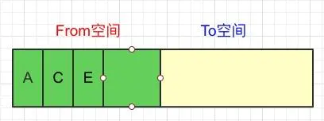

# JavaScript性能优化

## 1、什么是内存管理

- 申请内存空间
- 使用内存空间
- 释放内存空间

`JavaScript`在内存管理上与其它语言是类似的，也是经过了以上三个阶段。

## 2、什么是垃圾回收

如果程序在后续的执行中，发现某些对象不再被引用时就会被认为是垃圾

`JavaScript`的执行引擎会回收这些垃圾对象所占用的内存空间，这个过程就是`JavaScript`的垃圾回收。(如果某个对象一直可以被访问使用，就不是垃圾，而这种可以被访问到的对象，我们称之为'可达对象')

所谓"可达对象"：指的就是可以被访问到的对象就是可达对象。

## 3、引用计数算法优缺点

```
优点
      1、发现垃圾立即回收
      2、最大限度的减少了程序的暂停
 缺点
      1、无法回收循环引用的对象
      2、时间开销比较大
```

## 4、标记清除算法介绍

第一个阶段，遍历所有对象，找到活动的对象，然后进行标记

第二个阶段还是会遍历所有对象，并对没有标记的对象进行清除

## 5、V8引擎介绍

`V8`引擎的性能是非常高的。性能高的原因：

第一：优秀的内存管理机制

第二：`V8`引擎采用即时编译。也就是可以直接将`javascript`代码翻译成机器码进行执行。这样导致的结果就是执行的速度非常快。

第三：`V8`引擎内存是有上限的，在64位操作系统中，内存不超过`1.5G`.对32位操作系统是不超过`800M`. 

## 6、V8引擎垃圾回收的机制

`V8`引擎采用分代回收的思想，将内存分为新生代和老生代。

第一步： 在From空间中分配了3个对象A、B、C




第二步：`GC`进来判断对象B没有其他引用，可以回收，对象A和C依然为活跃对象.



第三步：将活跃对象A、C从From空间复制到To空间




第四步：清空From空间的全部内存



第五步：交换From空间和To空间



第六步：在From空间中又新增了2个对象D、E



第七步：下一轮`GC`进来发现对象D没有引用了，做标记



第八步：将活跃对象A、C、E从From空间复制到To空间



第九步：清空From空间全部内存



第十步：继续交换From空间和To空间，开始下一轮



当一个对象经过多次复制后仍然存活，它就会被认为是生命周期较长的对象，这种生命周期较长的对象会被移动到老生代中。

对象从新生代移动到老生代的过程就叫做晋升。

对象晋升的条件主要有两个：

第一：对象从From空间复制到To空间时，会检查它的内存地址来判断这个对象是否已经经历过一次清除回收。如果已经经历过了，会将该对象从From空间移动到老生代空间中，如果没有，则复制到To空间

第二：当要从From空间复制一个对象到To空间时，如果To空间已经使用了超过25%，则这个对象直接晋升到老生代中。设置25%这个阈值的原因是当这次清除回收完成后，这个To空间会变为From空间，接下来的内存分配将在这个空间中进行。如果占比过高，内存就不够了，这样就会影响后续的内存分配。

下面我们再来看一下**`V8`引擎对老生代对象回收的实现过程。**


## 7、全局变量问题

```
1、全局变量查找比较消耗时间
 2、全局变量一直存储在内存中，降低了内存的使用。
 3、局部变量与全局变量重名的问题。
```

